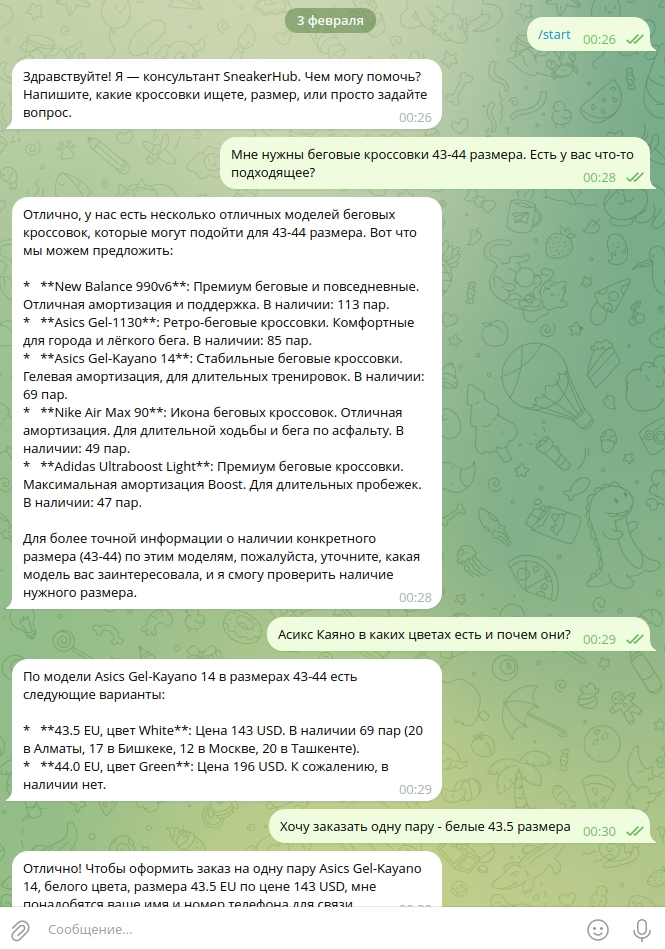
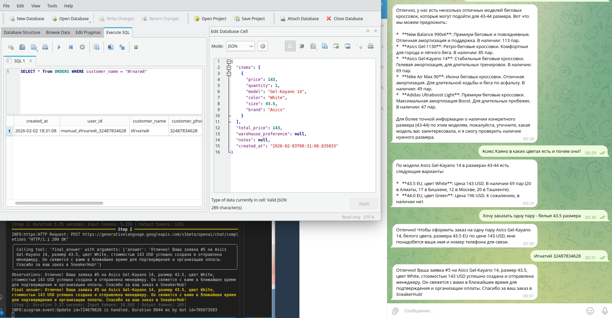

# SneakerHub AI Assistant

🎓 **Итоговый проект 2 курса (осень 2025) Deep Learning School МФТИ**

* [Deep Learning School](https://dls.samcs.ru)

---

Интеллектуальный чат-агент для интернет-магазина кроссовок SneakerHub, помогающий клиентам подбирать кроссовки, отвечающий на вопросы о моделях, размерах, наличии остатков, ценах и оформляющий предварительные заявки.


## Ключевые возможности

- RAG на базе собственной базы знаний
- Работа с SQLite: поиск моделей, остатки по складам, цены, детализация по товарам
- Поиск в интернете: актуальные отзывы, релизы, тренды, сравнения
- Оформление предварительных заявок на заказ (сохранение в БД)
- Чат-агент поддерживает только текстовый режим взаимодействия с пользователями
- Для взаимодействия с чат-агентом используется Telegram-бот 

Работа агента организована через систему инструментов (Tool Calling Agent) на базе smolagents + LLM (Gemini 2.5 Flash).

*SneakerHub AI Assistant - своего рода дальнейшее развитие моего предыдущего пет-проекта [agentic_rag](https://github.com/idalgo-2021/agentic_rag)*


## Использованные технологии

* **Язык:** Python
* **Агентский фрейворк:** smolagents
* **Векторное хранилище:** ChromaDB
* **Модель для эмбеддингов:** intfloat/multilingual-e5-large-instruct (**локальная**) 
* **Модель рассуждений агента:** gemini-2.0-flash (**удаленная**) 
* **БД:** SQLite
* **Telegram-фреймворк:** aiogram


## Важные особенности реализации

* ✅ **Это учебный, а не production-ready проект!**
* ✅ RAG строится на основе векторного хранилища **ChromaDB**, а данные для заполнения беруться из *.md файлов каталога `/raw`.
* ✅ Структура БД SQLite упрощена и служит лишь для демонстрации возможностей агента. 
* ✅ Используется `.env` файл для загрузки секретов(токены модели и ТГ-бота).
* ✅ Используется `config.yaml` файл для загрузки конфигурационных параметров и системного промпта агента.
* ✅ В проекте хоть и используется асинхронный ТГ- фреймворк **aiogram**, но используется лишь для демонстрации возможности взаимодействия (реализован только **polling** - режим). 
* ✅ Деплой в Интернете, как и технологии виртуализации - не используются.  


## Структура проекта


```
.
├── config.py                # Обработчик загрузки основного конфига
├── config.yaml              # Основной конфиг (промпт, LLM, пути)
├── data
│ └── sneakers.db            # SQLite база данных
├── init_sneakers_db.sql     # Скрипт инициализации БД
├── knowledge_base
│ ├── chroma_db              # Векторное хранилище Chroma
│ │ └── ...                  # Файлы Chroma (data_level0.bin и т.д.)
│ ├── raw                    # Исходные Markdown-файлы знаний
│ │ └── *.md                 # Документы магазина-основа базы знаний
│ └── vector_store           # Логика работы с Chroma
│     ├── chroma_repo.py     # Репозиторий/обёртка над Chroma
│     └── protocol.py        # Протокол (интерфейс) для векторного хранилища
├── main.py                  # Точка входа (и для консольного режима)
├── README.md                 
├── rebuild_index.py         # Перестройка индекса RAG
├── requirements.txt         # Зависимости
├── telegram_bot.py          # Telegram-интерфейс — основной способ использования сейчас. Можно переименовать в bot.py.
└── tools                    # Инструментарий агента
    ├── order_tool.py        # Создание заявок в БД
    ├── product_db_tool.py   # Получение сведений из БД
    └── rag_tool.py          # Инструментарий RAG

```

## Установка

```
python3 -m venv venv
source venv/bin/activate
pip install -r requirements.txt
```

## Настройка

***Обратите внимание, что проект в текущем варианте потребует около 7.3 ГБ места на диске(т.к. используются довольно большие библиотеки вроде torch)***

1. Создайте файл `.env` в корне проекта и укажите в нем токены - для рассуждающей LLM и для Telegram-бота (см. файл `.env_example`).
2. Определитесь с файлами для базы знаний(векторного хранилища). Используйте существующие файлы, либо замените их на свои в `knowledge_base/raw/`.
3. Проиндексируйте файлы для векторной базы знаний:

```
# Создание эмбедингов в векторном хранилище
python3 rebuild_index.py
```
4. Создайте БД, которая будет использоваться инструментами агента. Вам необходимо создать необходимые вам таблицы(и возможно предзаполнить их), либо воспользоваться скриптом из примера. Если измените имя файла БД, незабудьте скорректировать `config.yaml`.

```
# Создает и инициализирует(предзаполняет) таблицы БД SQLite data/sneakers.db 
sqlite3 data/sneakers.db < init_sneakers_db.sql

```

5. Запустите приложение:

* В режиме консольного приложения

    ```
    python3 main.py
    ```
* В режиме Telegram-бота *(в этом варианте консольный клиент также будет запущен, но в Telegram не будут выводиться промежуточные шаги "размышления" и действия агента - будут только финальные фразы)*

    ```
    python3 telegram_bot.py
    ```


## TODO List

1. Переработать архитектуру проекта:
    
    * Использовать Production-ориентированные базы данных(векторную и обычное персистентное хранилище) и паттерны взаимодействия с ними.
    * Реализовать асинхронную\параллельную обработку сообщений от пользователей(вероятно `Worker Pool`).
    * Проработать скорость и надежность системы в целом.
    * Использовать очереди сообщений, особенно при взаимодействии с Telegram-ботом.
    * Добавить логирование (из STDOUT).
2. Добавить аудио-канал взаимодействия с агентом(вероятно `Whisper`)
    * Прием голосовых сообщений от пользователей.
    * Формирование голосовых ответов пользователям.
3. CI \ CD проекта в Интернет.


## Работа программы

**Скринкаст:** - [Ссылка на Яндекс Диск](https://disk.yandex.ru/i/r_VCaeiH80BzFw)


**Скриншоты:**

*Диалог с клиентом*




*Регистрация заявки клиента*


